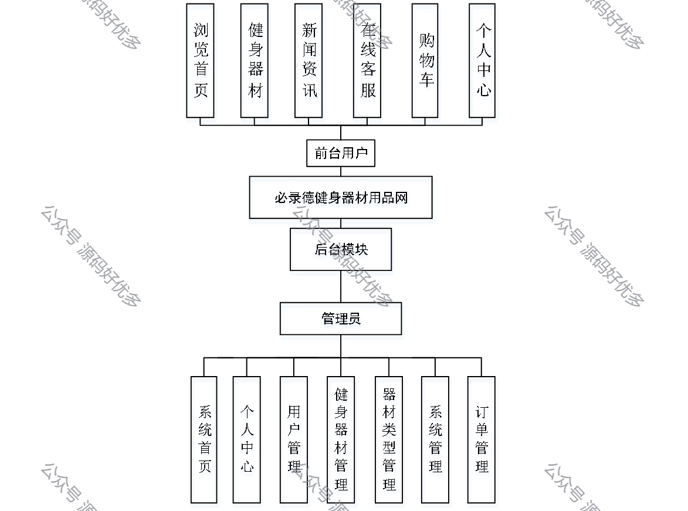
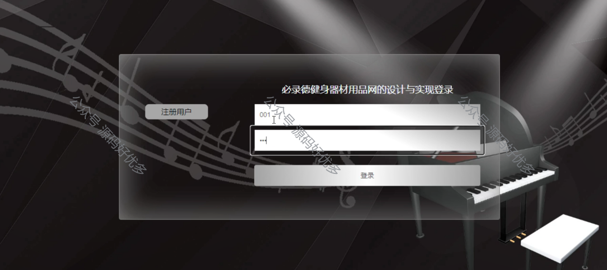
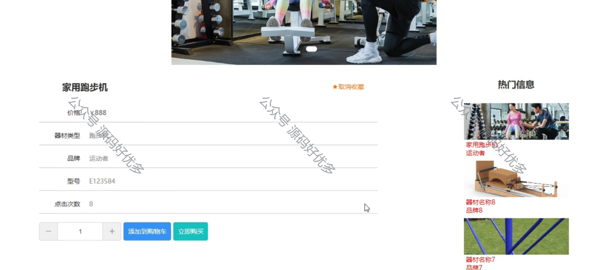
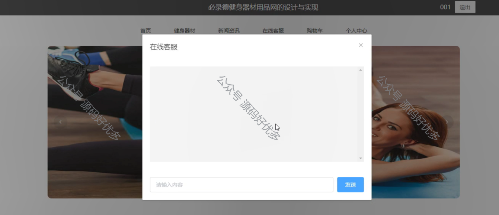
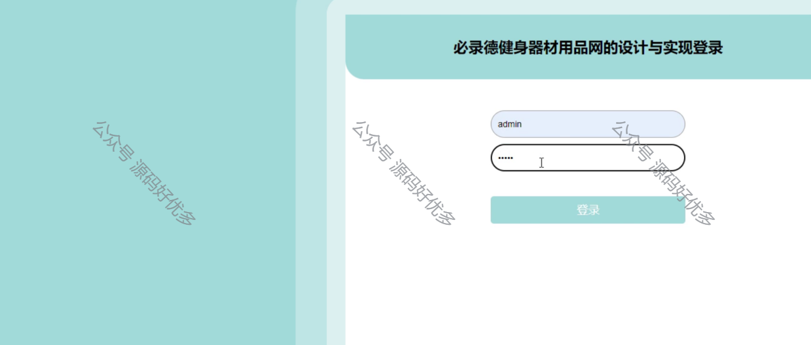
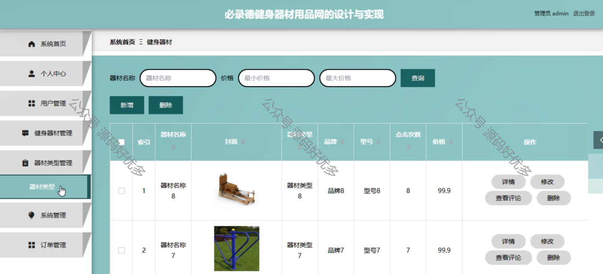
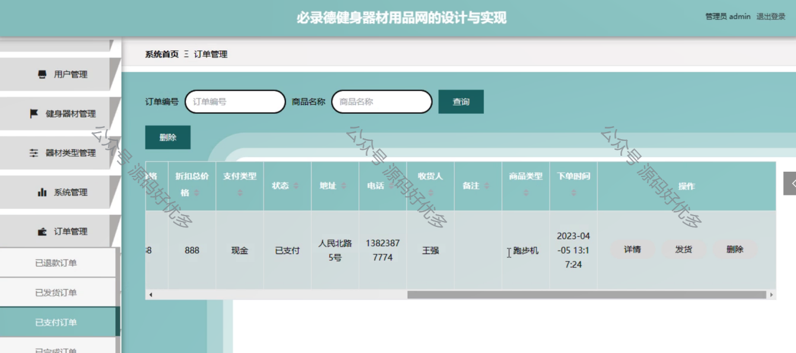
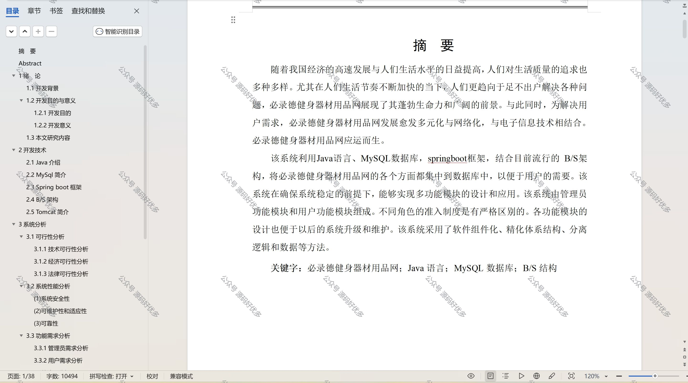

 
## 查看主页获取源码

> **作者介绍**： **✌**全网粉丝10W+本平台特邀作者、博客专家、CSDN新星计划导师、java领域优质创作者,博客之星、掘金/华为云/阿里云/InfoQ等平台优质作者、专注于项目实战 **✌**

  

### 一、作品包含

源码+数据库+设计文档万字+PPT+全套环境和工具资源+部署教程

### 二、项目技术

前端技术：Html、Css、Js、Vue、Element-ui

数据库：MySQL

后端技术：Java、Spring Boot、MyBatis

  

### 三、运行环境

开发工具：IDEA/eclipse

数据库：MySQL5.7

数据库管理工具：Navicat10以上版本

环境配置软件： JDK1.8+Maven3.6.3

前端Nodejs：14

### 四、项目介绍
项目编号：springbootA088

必录德健身器材用品网是一个专业的在线健身器材销售平台，提供各类高品质的健身设备和配件，旨在帮助消费者打造个性化的家庭健身房，同时通过丰富的产品信息、便捷的在线购物体验和优质的客户服务，满足广大健身爱好者的需求，推动健康生活方式的普及。

必录德健身器材用品网的系统主要面向前台用户和管理员两个角色，其中前台用户可以享受浏览首页、查看健身器材、获取新闻资讯、使用在线客服、管理购物车以及访问个人中心等功能；而管理员则负责管理用户信息、健身器材库存、器材类型分类、系统设置以及处理订单等操作，确保网站的顺畅运行和用户满意度。

### 五、运行截图

  
